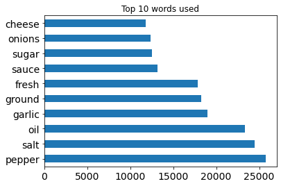
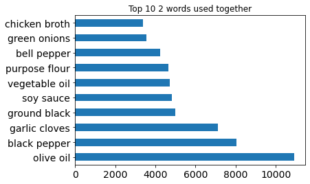

### Introduction

This was a Kaggle competition from 2015 where you are given a list of ingredients to build a classifier model that predicts cuisine.  There were 39,744 recipes to train on.  The results were

### EDA

### Summary of models

|    | estimator                  | transformer     |   Grid Search Train Score |   Grid Search Test Score |
|---:|:---------------------------|:----------------|--------------------------:|-------------------------:|
|  0 | RandomForestClassifier     | TfidVectorizer  |                    0.9998 |                    0.745 |
|  1 | GradientBoostingClassifier | CountVectorizer |                    0.77   |                    0.71  |
|  2 | GradientBoostingClassifier | TfidfVectorizer |                    0.79  |                    0.71 |

Although Random Forest was overfit it looks like it performed the best on the test set.

### Data

Link to Dataset [link](https://www.kaggle.com/c/whats-cooking/data)

### Bonus

I also deployed this model to streamlit.  From terminal in the file directory if you run streamlit run cuisine.py it will launch in a local browser.
